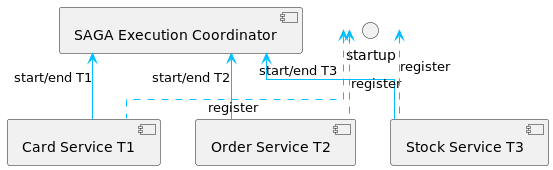

# SAGA architecture pattern 

SAGA is an architectural pattern use in microservices.

This pattern is an alternative to 2PC (2 phase commit) that is use in a distributed transaction.

However, 2PC has many shortcomings:
- The coordinator node is a single point of failure as it's the only one who know the state of the transaction.
- It is slow by design (very heavy on message and dependent of the coordinator).
- The slower service is the one everyone have to wait to terminate the transaction.
- The protocol is not supported by many noSQL databases.

## Basic principle

The SAGA pattern provides a multi-service transaction management using a sequence of local transactions.

**The local transaction** is the unit of work of a service.
In the SAGA pattern, every operation can be _rollback_ by a **compensating transaction**.

The compensation transaction **must be idempotent and retryable**.

## SAGA Execution Coordinator (SEC)

The SAGA pattern required a SAGA Execution Coordinator that is responsible to capture the sequence of local transaction.

If any service that participate in the SAGA failed, the SEC uses the compensating transactions to roll back all impacted services.

If the SEC failed, it can read the log of the SAGA to restart it correctly.

## Implementing SAGA

There are 2 ways:
 1- Choreography: the saga's participants exchange events.
 2- Orchestration: a centralized orchestrator use messaging to tell the participants what to do.

Choreography works well with simple SAGA but Orchestration may be a good choice for complex one.

